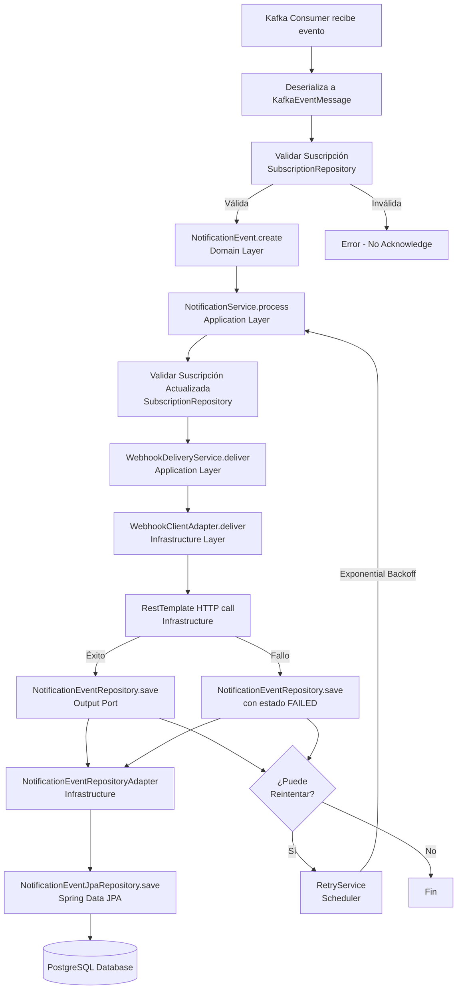
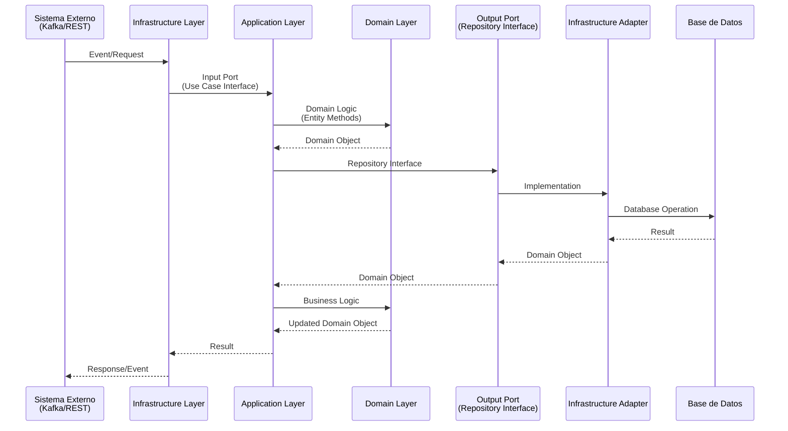

# Arquitectura - Cobre Notifier API

## 📐 Arquitectura Hexagonal (Ports & Adapters)

Este proyecto implementa una **Arquitectura Hexagonal** (también conocida como Ports & Adapters), que separa la lógica de negocio de los detalles técnicos de infraestructura.

## 🎯 Principios

1. **Separación de Responsabilidades**: Cada capa tiene una responsabilidad clara
2. **Inversión de Dependencias**: Las capas externas dependen de las internas, no al revés
3. **Testabilidad**: La lógica de negocio puede ser testeada sin infraestructura
4. **Flexibilidad**: Fácil cambiar implementaciones de infraestructura sin afectar el dominio

## 🏗️ Estructura de Capas

```
┌─────────────────────────────────────────────────────────┐
│                    Domain Layer                         │
│  ┌─────────────────────────────────────────────────┐  │
│  │  Entities: NotificationEvent, Subscription      │  │
│  │  Value Objects: DeliveryStatus                   │  │
│  │  Domain Exceptions                              │  │
│  └─────────────────────────────────────────────────┘  │
└─────────────────────────────────────────────────────────┘
                         ▲
                         │
┌─────────────────────────────────────────────────────────┐
│                 Application Layer                        │
│  ┌─────────────────────────────────────────────────┐  │
│  │  Input Ports (Use Cases):                       │  │
│  │    - ProcessNotificationUseCase                 │  │
│  │    - RetryFailedNotificationsUseCase            │  │
│  │    - GetNotificationEventsUseCase               │  │
│  │    - ReplayNotificationUseCase                  │  │
│  │                                                  │  │
│  │  Output Ports (Repositories):                   │  │
│  │    - NotificationEventRepository                │  │
│  │    - SubscriptionRepository                     │  │
│  │                                                  │  │
│  │  Services:                                      │  │
│  │    - NotificationService                        │  │
│  │    - RetryService                               │  │
│  │    - WebhookDeliveryService                     │  │
│  └─────────────────────────────────────────────────┘  │
└─────────────────────────────────────────────────────────┘
                         ▲
                         │
┌─────────────────────────────────────────────────────────┐
│              Infrastructure Layer                        │
│  ┌──────────────┬──────────────┬──────────────────┐   │
│  │ Persistence  │    Kafka     │      Web          │   │
│  │              │              │                   │   │
│  │ - JPA        │ - Consumer   │ - REST Controller│   │
│  │ - Flyway     │ - Config     │ - DTOs            │   │
│  │ - Adapters   │ - DTOs       │ - Exception       │   │
│  │              │              │   Handler         │   │
│  └──────────────┴──────────────┴──────────────────┘   │
│  ┌─────────────────────────────────────────────────┐  │
│  │  Webhook Client                                  │  │
│  │  - RestTemplate                                  │  │
│  │  - Prometheus Metrics                            │  │
│  └─────────────────────────────────────────────────┘  │
└─────────────────────────────────────────────────────────┘
```

## 📦 Capas Detalladas

### 1. Domain Layer (Capa de Dominio)

**Responsabilidad**: Contiene la lógica de negocio pura, sin dependencias externas.

**Componentes**:
- **Entidades**: `NotificationEvent`, `Subscription`
- **Value Objects**: `DeliveryStatus` (enum)
- **Excepciones de Dominio**: `DomainException`, `NotificationNotFoundException`, etc.

**Características**:
- ✅ Sin dependencias de frameworks
- ✅ Lógica de negocio encapsulada
- ✅ Inmutabilidad donde sea posible
- ✅ Validaciones de negocio

**Ejemplo**:
```java
public class NotificationEvent {
    // Métodos de negocio
    public static NotificationEvent create(...) { ... }
    public void markAsSent(...) { ... }
    public boolean canRetry(int maxRetries) { ... }
}
```

### 2. Application Layer (Capa de Aplicación)

**Responsabilidad**: Orquesta los casos de uso y coordina entre dominio e infraestructura.

**Componentes**:
- **Input Ports**: Interfaces que definen casos de uso
- **Output Ports**: Interfaces que definen contratos de persistencia
- **Services**: Implementación de casos de uso

**Características**:
- ✅ Depende solo del Domain Layer
- ✅ Define contratos (interfaces) para infraestructura
- ✅ Implementa lógica de aplicación (orquestación)
- ✅ Transaccional donde sea necesario

**Ejemplo**:
```java
public interface ProcessNotificationUseCase {
    NotificationEvent process(NotificationEvent notification);
}

@Service
public class NotificationService implements ProcessNotificationUseCase {
    // Implementación del caso de uso
}
```

### 3. Infrastructure Layer (Capa de Infraestructura)

**Responsabilidad**: Implementa los detalles técnicos y adaptadores externos.

**Componentes**:

#### Persistence
- **JPA Entities**: `NotificationEventEntity`, `SubscriptionEntity`
- **Repositories**: Spring Data JPA interfaces
- **Adapters**: Implementan los Output Ports
- **Mappers**: Convierten entre Domain y JPA entities
- **Flyway**: Migraciones de base de datos

#### Kafka
- **Consumer**: Consume eventos de `platform.events`
- **Config**: Configuración de Kafka listeners
- **DTOs**: `KafkaEventMessage` para deserialización

#### Webhook
- **WebhookClientAdapter**: Envía webhooks HTTPS
- **RestTemplate**: Cliente HTTP configurado
- **Métricas Prometheus**: Integradas en el adapter

#### Web (REST API)
- **Controller**: Endpoints REST
- **DTOs**: Request/Response DTOs
- **Mapper**: Convierte Domain → DTOs
- **Exception Handler**: Manejo global de excepciones

## 🔄 Flujo de Datos

### Flujo de Procesamiento de Notificación



### Diagrama de Secuencia - Arquitectura Hexagonal

Este diagrama muestra cómo las capas interactúan siguiendo los principios de arquitectura hexagonal.



## 🔌 Puertos (Ports)

### Input Ports (Puertos de Entrada)

Interfaces que definen los casos de uso que la aplicación puede realizar:

- `ProcessNotificationUseCase`: Procesa una notificación
- `RetryFailedNotificationsUseCase`: Reintenta notificaciones fallidas
- `GetNotificationEventsUseCase`: Consulta notificaciones
- `ReplayNotificationUseCase`: Reintenta manualmente una notificación

### Output Ports (Puertos de Salida)

Interfaces que definen contratos para acceso a datos:

- `NotificationEventRepository`: Operaciones CRUD de notificaciones
- `SubscriptionRepository`: Operaciones CRUD de suscripciones

## 🔧 Adaptadores (Adapters)

### Adapters de Persistencia

- `NotificationEventRepositoryAdapter`: Implementa `NotificationEventRepository`
- `SubscriptionRepositoryAdapter`: Implementa `SubscriptionRepository`

**Conversión**:
- Domain Entities ↔ JPA Entities (usando Mappers)
- Domain Logic ↔ Database Operations

### Adapters de Kafka

- `KafkaEventConsumer`: Consume eventos y delega a Application Layer
- `KafkaConfig`: Configuración de listeners

### Adapters de Webhook

- `WebhookClientAdapter`: Envía webhooks con métricas integradas

### Adapters de Web

- `NotificationEventController`: Expone REST API
- `NotificationEventWebMapper`: Convierte Domain → DTOs
- `GlobalExceptionHandler`: Maneja excepciones HTTP

## 🧪 Testabilidad

La arquitectura hexagonal facilita el testing:

1. **Domain Layer**: Tests unitarios puros, sin mocks
2. **Application Layer**: Tests con mocks de Output Ports
3. **Infrastructure Layer**: Tests de integración con Testcontainers

**Ejemplo de Test de Application Layer**:
```java
@ExtendWith(MockitoExtension.class)
class NotificationServiceTest {
    @Mock
    private NotificationEventRepository repository;  // Output Port mockeado
    
    @Mock
    private SubscriptionRepository subscriptionRepository;
    
    @InjectMocks
    private NotificationService service;  // Application Service
}
```

## 📊 Ventajas de esta Arquitectura

1. **Mantenibilidad**: Código organizado y fácil de entender
2. **Testabilidad**: Cada capa puede testearse independientemente
3. **Flexibilidad**: Fácil cambiar implementaciones (ej: cambiar de JPA a MongoDB)
4. **Escalabilidad**: Fácil agregar nuevos adaptadores
5. **Separación de Concerns**: Lógica de negocio separada de detalles técnicos

## 📈 Diagramas Adicionales

Para ver más diagramas detallados del sistema, consulta:
- [Diagramas Completos](DIAGRAMS.md) - Flujos, secuencias y ciclo de vida

## 🔄 Dependencias

```
Infrastructure → Application → Domain
     ▲              ▲            ▲
     │              │            │
     └──────────────┴────────────┘
     (Solo Infrastructure depende de frameworks)
```

**Regla de Dependencias**:
- Domain: Sin dependencias externas
- Application: Depende solo de Domain
- Infrastructure: Depende de Application y Domain

## 📚 Referencias

- [Hexagonal Architecture (Alistair Cockburn)](https://alistair.cockburn.us/hexagonal-architecture/)
- [Ports and Adapters Pattern](https://www.hexagonalarchitecture.com/)

