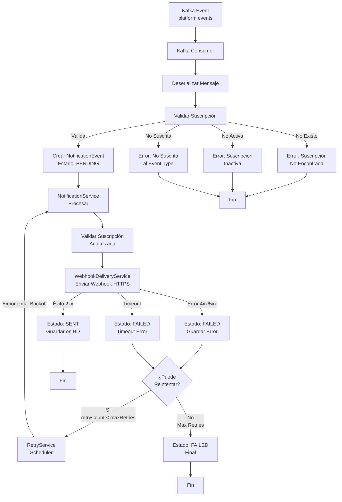
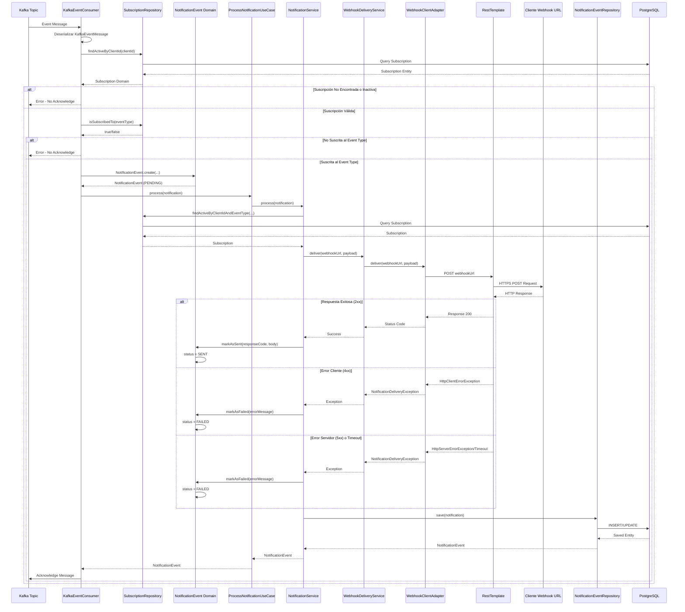
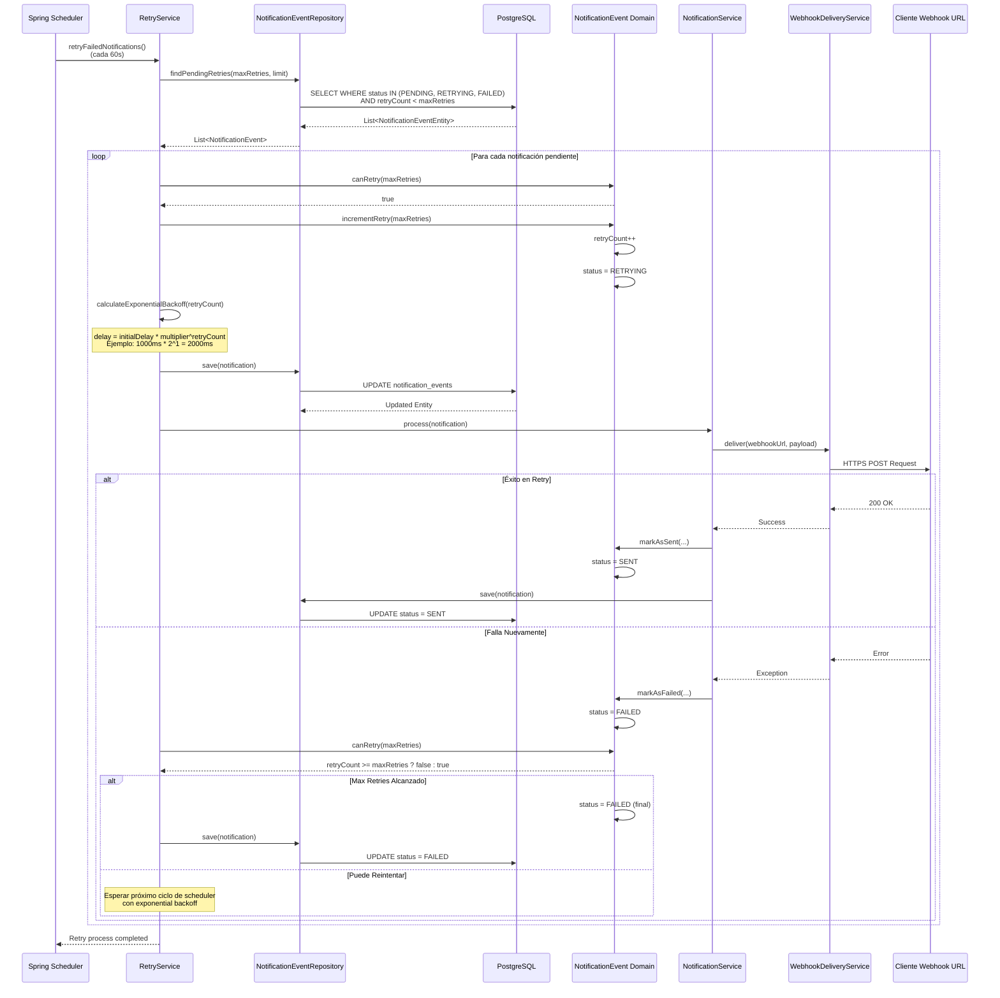
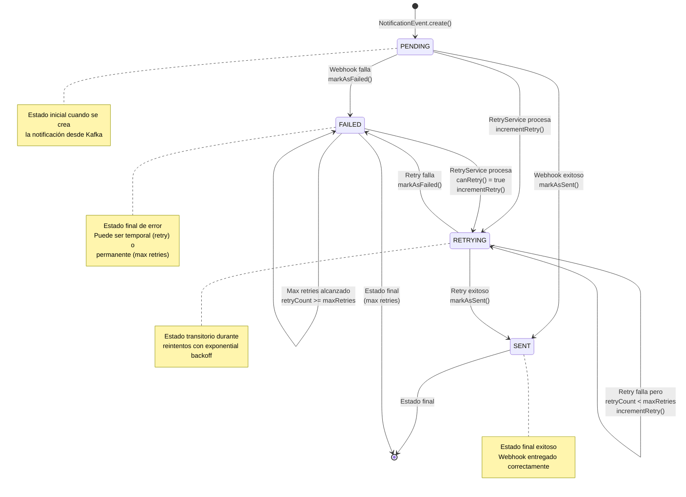
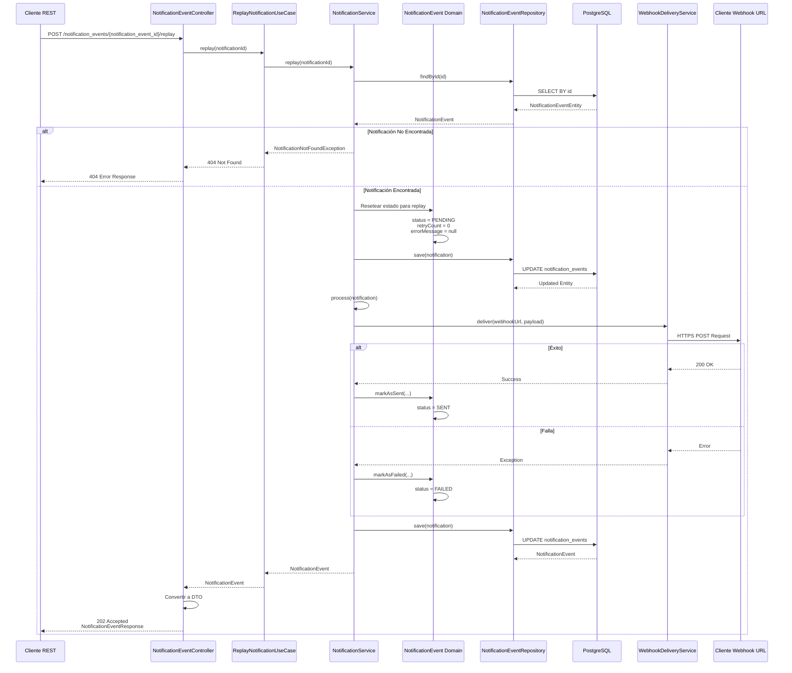

# Diagramas del Sistema

Esta sección contiene diagramas visuales que explican el funcionamiento, arquitectura y flujos del sistema Cobre Notifier API.

## Flujo de Funcionamiento Alto Nivel

Este diagrama muestra el flujo principal del sistema desde que recibe un evento de Kafka hasta la entrega del webhook.

**Código fuente del diagrama:**

## Arquitectura Detallada

Diagrama que muestra la arquitectura hexagonal con todos sus componentes y sus relaciones.

**Código fuente del diagrama:**

```mermaid
graph TB
    subgraph Infrastructure["Infrastructure Layer"]
        subgraph KafkaInfra["Kafka"]
            KafkaConsumer[KafkaEventConsumer]
            KafkaConfig[KafkaConfig]
            KafkaDTO[KafkaEventMessage]
        end
        subgraph PersistenceInfra["Persistence"]
            JPAEntities[NotificationEventEntity<br/>SubscriptionEntity]
            JPARepos[NotificationEventJpaRepository<br/>SubscriptionJpaRepository]
            Adapters[NotificationEventRepositoryAdapter<br/>SubscriptionRepositoryAdapter]
            Mappers[NotificationEventMapper<br/>SubscriptionMapper]
        end
        subgraph WebInfra["Web REST API"]
            Controller[NotificationEventController]
            WebDTOs[NotificationEventResponse<br/>NotificationEventFilterRequest]
            WebMapper[NotificationEventWebMapper]
            ExceptionHandler[GlobalExceptionHandler]
        end
        subgraph WebhookInfra["Webhook Client"]
            WebhookAdapter[WebhookClientAdapter]
            RestTemplate[RestTemplate]
            Metrics[Prometheus Metrics]
        end
    end
    
    subgraph Application["Application Layer"]
        subgraph InputPorts["Input Ports"]
            ProcessUseCase[ProcessNotificationUseCase]
            RetryUseCase[RetryFailedNotificationsUseCase]
            GetUseCase[GetNotificationEventsUseCase]
            ReplayUseCase[ReplayNotificationUseCase]
        end
        subgraph OutputPorts["Output Ports"]
            NotificationRepo[NotificationEventRepository]
            SubscriptionRepo[SubscriptionRepository]
        end
        subgraph Services["Services"]
            NotificationService[NotificationService]
            RetryService[RetryService]
            WebhookDeliveryService[WebhookDeliveryService]
        end
    end
    
    subgraph Domain["Domain Layer"]
        NotificationEvent[NotificationEvent]
        Subscription[Subscription]
        DeliveryStatus[DeliveryStatus Enum]
        DomainExceptions[Domain Exceptions]
    end
    
    KafkaConsumer --> ProcessUseCase
    ProcessUseCase --> NotificationService
    NotificationService --> NotificationRepo
    NotificationService --> SubscriptionRepo
    NotificationService --> WebhookDeliveryService
    WebhookDeliveryService --> WebhookAdapter
    RetryService --> RetryUseCase
    RetryUseCase --> NotificationService
    Controller --> GetUseCase
    Controller --> ReplayUseCase
    GetUseCase --> NotificationService
    ReplayUseCase --> NotificationService
    
    NotificationService --> NotificationEvent
    NotificationService --> Subscription
    RetryService --> NotificationEvent
    
    NotificationRepo --> Adapters
    SubscriptionRepo --> Adapters
    Adapters --> JPARepos
    Adapters --> Mappers
    Mappers --> JPAEntities
    Mappers --> NotificationEvent
    Mappers --> Subscription
    
    WebhookAdapter --> RestTemplate
    WebhookAdapter --> Metrics
    Controller --> WebMapper
    WebMapper --> NotificationEvent
```

## Diagrama de Secuencia - Procesamiento de Notificación

Este diagrama muestra la secuencia completa de interacciones entre componentes cuando se procesa una notificación.

**Código fuente del diagrama:**

## Diagrama de Secuencia - Retry de Notificaciones Fallidas

Este diagrama muestra cómo funciona el proceso de retry con exponential backoff.

**Código fuente del diagrama:**

## Ciclo de Vida de una Notificación

Este diagrama muestra todos los estados posibles de una notificación y las transiciones entre ellos.

**Código fuente del diagrama:**

## Flujo de Replay Manual

Este diagrama muestra cómo funciona el endpoint de replay manual desde la API REST.

**Código fuente del diagrama:**

